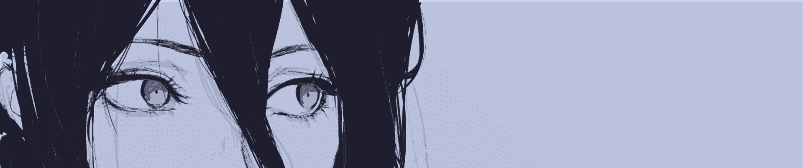

    
    <h1>Linux</h1>
    <h3></h3>

&nbsp;&nbsp;
&nbsp;&nbsp;
&nbsp;&nbsp;
&nbsp;&nbsp;

## Table of Contents

- [Description](#description)
- [Desktop Setup](#desktop-setup)
  - [KDE Settings](#kde-settings)
  - [GNOME Settings](#gnome-settings)
  - [Font](#font)
  - [Shell](#shell)
  - [Wallpapers](#wallpapers)
- [Shortcuts and Commands](#shortcuts-and-commands)

## Description

This is my personal Linux configuration. The setup is a bit of a Frankenstein's monster, mixing original work with plenty of inspiration from:

- [Pazl27's dotfiles](https://github.com/Pazl27/dotfiles/tree/master)
- [Emmale64's KDE setup](https://www.reddit.com/r/unixporn/comments/1o4lofv/kde_who_needs_hyprland/)
- [Kuehnelt's solstice-dots](https://github.com/Kuehnelt/solstice-dots/tree/main)
- [agridyne's dotfiles-dt](https://github.com/agridyne/dotfiles-dt)
- [prathmesh0077's dotfiles](https://github.com/prathmesh0077)
- [neuromask's Catppuccin Linux Theme](https://github.com/neuromask/catppuccin-linux-theme)

Many of the configs are also slightly tweaked versions from the official [Catppuccin](https://catppuccin.com/) repositories.

## Desktop Setup

### KDE Settings

| Setting | Value |
| --- | --- |
| Global Theme | [Catppuccin Mocha Lavender](https://github.com/catppuccin/kde) |
| Colors | Catppuccin Mocha Lavender |
| Application Style | [Klassy](https://github.com/paulmcauley/klassy) |
| Plasma Style | Darkly |
| Window Decorations | [Klassy](https://github.com/paulmcauley/klassy) |
| Icons | [Papirus](https://github.com/PapirusDevelopmentTeam/papirus-icon-theme) + [Catppuccin folders](https://github.com/catppuccin/papirus-folders) |
| Cursors | Breeze Dark |
| Login Screen (SDDM) | Image of the Wallpaper |
| Splash Screen | Rem |
| Video Wallpaper (Lock Screen) | [Smart Video Wallpaper Reborn](https://github.com/luisbocanegra/plasma-smart-video-wallpaper-reborn) |
| Video Wallpaper (Desktop) | [Smart Video Wallpaper Reborn](https://github.com/luisbocanegra/plasma-smart-video-wallpaper-reborn) |

### GNOME Settings

| Setting | Value |
| --- | --- |
| Shell Theme | [Catppuccin GTK Theme](https://github.com/Fausto-Korpsvart/Catppuccin-GTK-Theme) ([apply via GNOME Tweaks](https://docs.rockylinux.org/desktop/gnome/gnome-tweaks/), [Flatpak guide](https://itsfoss.com/flatpak-app-apply-theme/)) |
| Icons | [Papirus](https://github.com/PapirusDevelopmentTeam/papirus-icon-theme) + [Catppuccin folders](https://github.com/catppuccin/papirus-folders) |
| Video Wallpaper (Desktop & Lock Screen) | [Hanabi](https://github.com/jeffshee/gnome-ext-hanabi) |

**Extensions** (managed with Extension Manager):

| Extension | Purpose |
| --- | --- |
| [Just Perfection](https://gitlab.gnome.org/jrahmatzadeh/just-perfection) | Customize GNOME Shell |
| [User Themes](https://gitlab.gnome.org/GNOME/gnome-shell-extensions) | Load shell themes from the user directory |
| [Dash to Panel](https://github.com/home-sweet-gnome/dash-to-panel) | Panel and taskbar |
| [Space Bar](https://github.com/christopher-l/space-bar) | Workspace indicator in the top bar |
| [Blur My Shell](https://github.com/aunetx/blur-my-shell) | Blur effects |
| [Caffeine](https://github.com/eonpatapon/gnome-shell-extension-caffeine) | Prevent sleep |
| [Vitals](https://github.com/corecoding/Vitals) | System monitor |
| [Start Overlay in Application View](https://extensions.gnome.org/extension/5040/start-overlay-in-application-view/) | Open the application grid with a single press of the Super key |

### Font

| Use Case | Font |
| --- | --- |
| Desktop / UI | Karla |
| Monospace (terminal, code) | Fira Code |

### Shell

Zsh with [Starship](https://github.com/catppuccin/starship/discussions/18) and the [Catppuccin Mocha zsh-syntax-highlighting](https://github.com/catppuccin/zsh-syntax-highlighting) theme.

### Wallpapers

- [Synthwave Dreamwave Girl](https://www.desktophut.com/synthwave-dreamwave-girl)
- [Digital Gaze](https://www.desktophut.com/digital-gaze-8642)

Additional wallpapers are filtered from the [Orangci collection](https://github.com/orangci/walls-catppuccin-mocha) and recolored with the [Wallpaper Theme Converter](https://notneelpatel.xyz/WallpaperThemeConverter/).

## Shortcuts and Commands

| Shortcut | Action |
| --- | --- |
| <kbd>Super</kbd> + <kbd>B</kbd> | Open Brave |
| <kbd>Super</kbd> + <kbd>C</kbd> | Open Visual Studio Code |
| <kbd>Super</kbd> + <kbd>E</kbd> | Open the file manager |
| <kbd>Super</kbd> + <kbd>T</kbd> | Open Kitty |
| <kbd>Super</kbd> + <kbd>Tab</kbd> | Open the overview |
| <kbd>Super</kbd> + <kbd>D</kbd> | Peek at desktop |
| <kbd>Super</kbd> + <kbd>W</kbd> | Close the active window |
| <kbd>Super</kbd> + <kbd>L</kbd> | Lock the session |
| <kbd>Super</kbd> + <kbd>Left/Right</kbd> | Switch workspace |
| <kbd>Super</kbd> + <kbd>1/2/3/4</kbd> | Switch to workspace 1, 2, 3, 4 |
| <kbd>Super</kbd> + <kbd>Shift</kbd> + <kbd>1/2/3/4</kbd> | Send window to workspace 1, 2, 3, 4 |
| <kbd>Super</kbd> + <kbd>F1/F2/F3/F4</kbd> | Activate task manager entry 1, 2, 3, 4 |
| <kbd>Shift</kbd> + <kbd>F1/F2/F3/F4</kbd> | Playlist 1, 2, 3, 4 |
| <kbd>Alt</kbd> + <kbd>Tab</kbd> | Switch windows |
| <kbd>Alt</kbd> + <kbd>Shift</kbd> + <kbd>Tab</kbd> | Switch windows in reverse |

### Extensions

| Shortcut | Action |
| --- | --- |
| <kbd>ScrollLock</kbd> | Chrome Extensions |

### Music Controls

| Shortcut | Action |
| --- | --- |
| <kbd>Insert</kbd> | Play/Pause |
| <kbd>Home</kbd> | Volume Up |
| <kbd>End</kbd> | Volume Down |
| <kbd>PageUp</kbd> | Next Track |
| <kbd>PageDown</kbd> | Previous Track |

### Hardware Controls

| Shortcut | Action |
| --- | --- |
| <kbd>Numpad4</kbd> | Toggle Fan |
| <kbd>NumpadEnter</kbd> | Find Phone |
| <kbd>NumpadAdd</kbd> | Increase Brightness |
| <kbd>NumpadSub</kbd> | Decrease Brightness |
