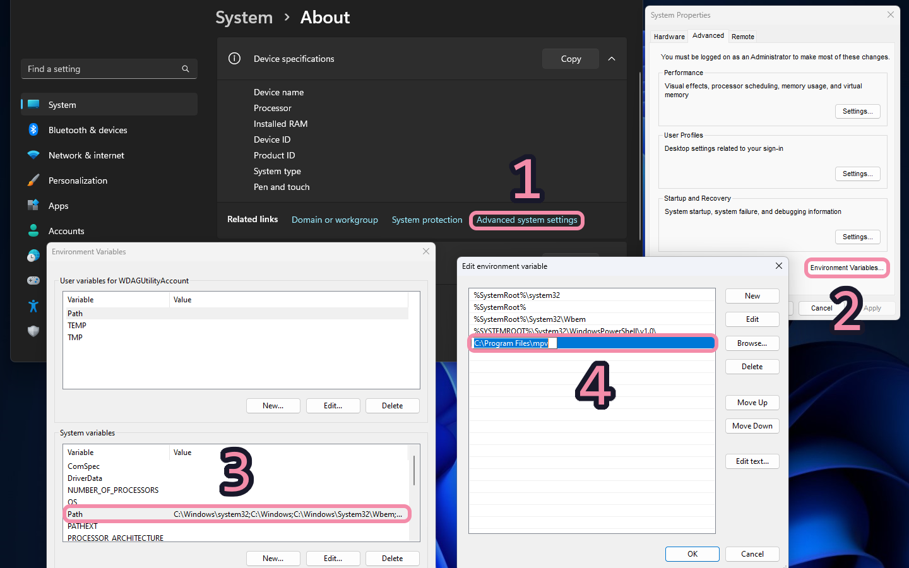
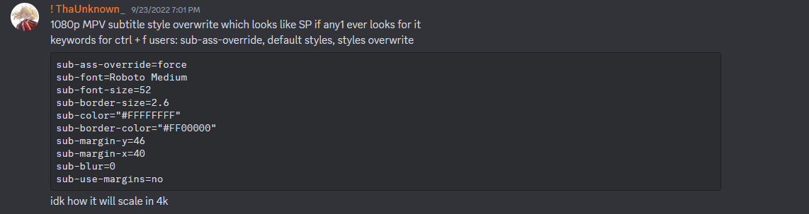
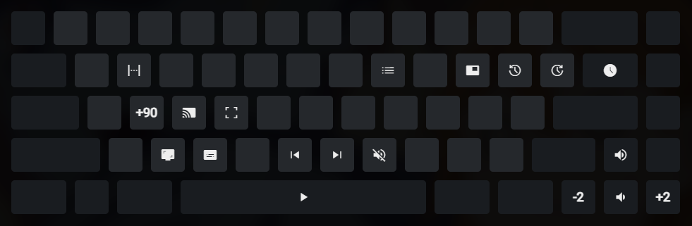

# To install mpv on Windows:

1. Download the latest version from [here](https://sourceforge.net/projects/mpv-player-windows/files/ "sourceforge link").
2. Extract the zip file.
3. Place the extracted folder in your C drive.
4. Add the mpv.exe path to the environment variables (system variables path).
5. Run `mpv_install.bat` as ADMIN under the installer folder to assign all video file extensions to mpv.



### Configuration:

mpv configuration files are stored in `%APPDATA%/mpv` on Windows.

- **Binaries:** `C:\Program Files\mpv`
- **Configuration:** `C:\Users/%username%/AppData/Roaming/mpv`

This folder generally stores `mpv.conf` and `input.conf` files. The `mpv` folder contains subfolders named `scripts` and `script-opts`, which store scripts and script settings/options.

---

### Scripts included:
- [chapterskip.lua][1]: Automatically skips chapters based on title like OP/Opening ED/Ending in anime.
- [playlistmanager.lua][2]: See and interact with your playlist easily using the 'F2' key.
- [webm.lua][3]: Make simple WebM clips using the 'F1' key.
- [thumbfast.lua][4]: Lightweight thumbnail generator script working with the ModernX script.
- [skip-intro][5]: The intended use for this is to skip until the end of an opening.
- [mpv-persist-properties][6]: Keep selected values like volume between player sessions.
- [mpv-anilist-updater][7]: A script for MPV that automatically updates your AniList based on the file you just watched.
- [SmartCopyPaste][8]: Gives mpv the capability to copy and paste while being smart and customizable...
- [memo][9]: This script saves your watch history, and displays it in a nice menu.

[1]: https://github.com/po5/chapterskip
[2]: https://github.com/jonniek/mpv-playlistmanager
[3]: https://github.com/ekisu/mpv-webm
[4]: https://github.com/po5/thumbfast
[5]: https://github.com/rui-ddc/skip-intro
[6]: https://github.com/d87/mpv-persist-properties
[7]: https://github.com/AzuredBlue/mpv-anilist-updater
[8]: https://github.com/Eisa01/mpv-scripts
[9]: https://github.com/po5/memo

---

### Source:
- https://github.com/itsmeipg/mpv-config/
- https://github.com/Sharad104/mpv-config
- https://github.com/Zabooby/mpv-config/
- https://github.com/Donate684/mpv-anime
- https://github.com/tuilakhanh/mpv-config/
- https://www.reddit.com/r/mpv/comments/1ej5srd/is_this_the_cleanest_looking_osc_ever/

---

### Fonts (SubsPlease)  

#### Available Attachments: 
- **Roboto**: `Roboto-Medium.ttf`, `Roboto-MediumItalic.ttf`  
  - Version: Version 2.138
```
sub-ass-override=force
sub-font=Roboto Medium
sub-font-size=52
sub-border-size=2.6
sub-color="#FFFFFFFF"
sub-border-color="#FF00000"
sub-margin-y=46
sub-margin-x=40
sub-blur=0
sub-use-margins=no
```


```bash
ffmpeg -i inputfile.mkv -map 0:s:0 outputfile.ass
```
---

# Keybinds for All Functions

- `,` - Seek 1 frame backwards
- `.` - Seek 1 frame forwards
- `S` - Seek forwards 90 seconds (skip opening)
- `R` - Seek backwards 90 seconds
- `→` - Seek forwards 2 seconds
- `←` - Seek backwards 2 seconds
- `↑` - Increase volume
- `↓` - Decrease volume
- `M` - Mute volume
- `C` - Cycle through subtitle tracks
- `N` - Play next episode (if available)
- `B` - Play last episode (if available)
- `F` - Toggle fullscreen
- `P` - Toggle picture-in-picture
- `I` - View video stats for nerds
- `X` - Save screenshot to clipboard
- `[` - Increase playback speed
- `]` - Decrease playback speed
- `\` - Reset playback speed to 1
- `` ` `` - Open keybinds UI


